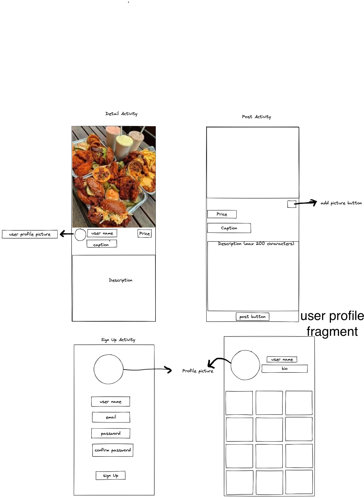
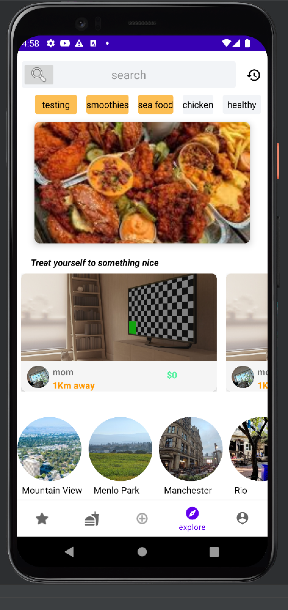
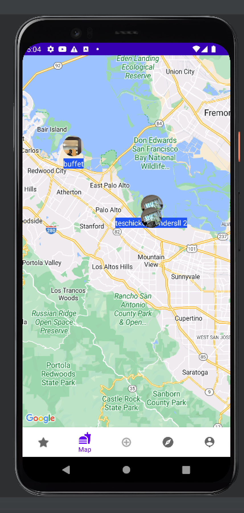

# Eats

## Table of Contents
1. [Overview](#Overview)
1. [Product Spec](#Product-Spec)
1. [Wireframes](#Wireframes)
1. [Schema](#Schema)

## Overview
### Description
 App allows users to share food they made with others. Users can sell food or give it for free. Users can also find food near them, including resturants.

### App Evaluation
- **Category:** Social Media/ Food
- **Mobile:** The app is intended for use in mobile devices. It will be primary be built for andriod but can be extended to iOS. It can also have a web presence to allow for flexibility and access on computers.
- **Story:** Helps users share food with others. Users can sell food they made or give it out for free
- **Market:** The target market is people looking for a place to eat or try homecooked food by someone else
- **Habit:** The app can be used whenever the user is in search of something to eat
- **Scope:** The initial focus is helping people find homecooked food near them. It can be extended to enable people acquire the required documentation and certification to trade food.

## Product Spec
### 1. User Stories (Required and Optional)

**Required Must-have Stories**

* Sign In page to enable users to login
* Sign Up page where users can create an account
* MapView where users can see food places near them
* Detail view where users can get more detail about the food or resturant

* user profile view: user can see their profile and that of others

**Optional Nice-to-have Stories**

* Enable users to comment on a post
* Enable users to like a post
* * Search/filter: users can search for specfic items or places

### 2. Screen Archetypes

** Login 
* Register - User signs up or logs into their account
   * Upon Download/Reopening of the application, the user is prompted to log in to gain access to their profile or to sign up for a new account. 
   * ...
* Map
   * user can see homes selling or sharing food and resturants near them and anywhere in the world
* Profile Screen 
   * User sees their previous posts. Visiting someone else' profile enables the user to see posts that were made by that user
* Search.
   * Search bar on top allows user to search for particular food or places.
* Details Screen
   * Allows people to get more details about the food they are interested in and the place it is being sold

### 3. Navigation


***Tab Navigation** (Tab to Screen)

* Map
* Profile
* Search

**Flow Navigation** (Screen to Screen)
* Forced Log-in -> Account creation if no log in is available
* MapView -> clicking on an item goes to detail view of that item
* Profile -> list of previous post made by that user. clicking an item gives option to delete or go to details view 
* Search -> text field to enter query and button to trigger search

## Wireframes


### [BONUS] Digital Wireframes & Mockups


### [BONUS] Interactive Prototype

## Schema 
### Models
#### Post

   | Property      | Type     | Description |
   | ------------- | -------- | ------------|
   | objectId      | String   | unique id for the user post (default field) |
   | user        | Pointer to User|  author of the post |
   | image         | File     | image that user posts |
   | caption       | String   | string caption by author |
   | createdAt     | DateTime | date when post is created (default field) |
   | updatedAt     | DateTime | date when post was last updated (default field) |
   | latitude     | Number| Latitude of coordinate where the post was made|
   | longitude     | Number| Longitude of coordinate where the post was made|
   | price     | Number| The cost of the food per item|
   | category     | String| The category that the food item belongs to (e.g mexican food)|
   | city     | Pointer City| The city that the post was made in|
   | geohash     | String| The geohash idenitfying which grid (area) on earth the post was made|
   
   #### User

   | Property      | Type     | Description |
   | ------------- | -------- | ------------|
   | objectId      | String   | unique id for the user post (default field) |
   | username      | String   | the screen name of the user |
   | userProfilePic| File     | image to be used as avatar for user |
   | bio           | String(Optional)| Offers a description about the user |
   | password | Alphanumeric   | password user uses for authentication |
   | email    | String   | email account associated with user|
   | createdAt     | DateTime | date when user created account (default field) |
   | updatedAt     | DateTime | date when user last updated their account (default field) |
   | emailVerified     | Boolean | indicates whether user has verified their email (default field) |
   | authData     | Parse Object | contains info about user authentication (default field) |
   
      #### City

   | Property      | Type     | Description |
   | ------------- | -------- | ------------|
   | objectId      | String   | unique id for the user post (default field) |
   | name      | String   | the name of the city |
   | imageUrl| File     | image of the city obtained from Google Maps Places API |
   | createdAt     | DateTime | date when user created account (default field) |
   | updatedAt     | DateTime | date when user last updated their account (default field) |

### Networking
#### List of network requests by screen
   - Home Feed Screen
      - (Read/GET) Query all posts of food currently in database 
         ```Java
        queryPosts() {
            ParseQuery<Post> query = ParseQuery.getQuery(Post.class);
            query.setLimit(20); //load first 20 posts
            query.include(Post.USER);
            query.addDescendingOrder("createdAt");
            query.findInBackground(new FindCallback<Post>() {
                @Override
                public void done(List<Post> posts, ParseException e) {
                    if(e != null) {
                        Log.i("HOME", "something went wrong obtaining posts " + e);
                    }

                    // save received posts to list and notify adapter of new data
                    mAllPosts.addAll(posts);
                    mPostsAdapter.notifyDataSetChanged();
                   mScrollListener.resetState();
                }
            });
        }
         ```
   - Create Post Screen
      - (Create/POST) Create a new post object
   - Profile Screen
      - (Read/GET) Query logged in user object
      - (Read/GET) Query posts made by logged in user
      - (Update/PUT) Update user profile image
      - (Delete) Delete a post  
   - Map Screen
      - (Read/GET) Query the user's current location
      - (Read/GET) Query all posts of food currently in database and return their location
#### [OPTIONAL:] Existing API Endpoints

### Description of completed MVP Goals Functionality
- Login Activity
  - users can enter username and password to sign in
  - If user enters wrong credentials, feedback is given to them to let them know they entered "invalid username/password"
  - users can tap "create account" button to make new account
- Sign Up Activity
  - users can create a new account
- TimeLine Fragment
  - users can see list of posts close to them
  - users can click on post to see details about post
  - infinite scroll to enable user to see more posts as they scroll down
- Map Fragment
  - user can see their location on the map
  - user can see posts near them represented by markers
  - users can click on posts to see details about the post
  - user can zoom in and out of map as they please to see more posts
- Post Fragment
  - user can add a new post
  - user can either take a new picture or select a picture from their gallery to attach to their post
  - user can see feedback about progress of their post being made with their intermediate progress view
- User Profile Fragment
  - User can see their profile picture, user name, and bio
  - User can see list of all posts they have made
  - Users can change profile picture by tapping on their avatar
  - Users can log out of app by long pressing their avatar
  - Users can see details of a post by clicking on it
  - Users can delete a post they made by long pressing

### Stretch Features
- Search Fragment
    - Enables users to search for specific posts
    - Users can search by typing name of item they want. This search is done by querying the database for posts whose caption, description or category starts with the user query
    - Users can filter items by
        - City of posts (e.g show posts in San Fransisco only)
        - Category of posts (e.g show posts about ice cream only)
    - User can see Featured item image. The featured item is randomly generated post from the list of posts returned that has been "featured" and remains on display 
    - Infinite scroll to show all posts returned
    - users can click on a post to see details about it
- Recent History Activity
    - Users can see the recent posts they searched for
    - Users can click on a post to see details about it
    - Caching is used to enable this functionality (more on this in Complex Features section)
    
- Created Custom onClick interface
    - Created a custom on click interface to respond to click events on items in recycler view
    - I did this because the recycler view has no default on click listener that identifies which specific items have been clicked
    - This functionality was needed to help me keep track of which categories the user has clicked in the search fragment so that I can use them to filter posts  by the clicked categories. I wanted to enable the user to click *multiple* categories at once. The default listener on a recycler view's adapter only allows selection of one item at a time.
    - To solve this, I created my own onClick interface
    - Here is the code
      ```
      public interface OnClickInterface {
          void setClick(String Category);
      }
      ```
      
      - I then attached it to the adpater 
      
      
      ```
      //modified adapter class to attach custom onClick listener
      public class CategoriesAdapter extends RecyclerView.Adapter<CategoriesAdapter.ViewHolder>{
          .
          .
          .
          OnClickInterface mOnClickInterface;
          
          //modified constructer to pass in custom onClick listener
          public CategoriesAdapter(Context context, List<Post> posts, OnClickInterface onClickInterface) {
              .
              .
              .
              this.mOnClickInterface = onClickInterface;
          }
          .
          .
          .
          //modified inner ViewHolder class
          public class ViewHolder  extends  RecyclerView.ViewHolder{
              .
              .
              .

              public void bind(Post post) {
                  .
                  .
                  .

                  //listens for click event
                  mCategory.setOnClickListener(new View.OnClickListener() {
                      @Override
                      public void onClick(View v) {
                          .
                          .
                          .

                         //set custom on click interface
                         mOnClickInterface.setClick(post.getCategory());
                     }
                  });

            }
            .
            .
            .
        }
        ```
        - I then used it to keep track of clicked categories in the search fragment like this
            ```
              @Override
             public void onCreate(Bundle savedInstanceState) {
                 super.onCreate(savedInstanceState);

                 mCategoriesClicked = new HashSet<>();

                 //set custom on click interface
                 //this adds clicked categories to the set and removes items clicked if they are already in the set
                mOnClickInterface = new OnClickInterface() {
                   @Override
                   public void setClick(String category) {
                       if(!mCategoriesClicked.add(category)) {
                       mCategoriesClicked.remove(category);
                   }
                   
                   //call function to filter posts by current selected categories
                   filterByCategory();
               }
            };
           ```
           - example of multiple categories clicked at once (In App ScreenShot). The clicked categories are colored orange: 
           
         
# Stretch Features Continued
- Custom TextView background for better UI
- Custom Markers to display on the map
  - My markers show the profilePicture of the person that made the post and the caption is used as the snippet
  - I accomplished this by converting an xml file into a bitmap that can be used by google maps as an icon for a marker
  - In app screen shots of custom markers 
  
- Users can profiles of other users
  - the current signed in user can visit other people's profiles by tapping on the profile picture embedded in a post
  - user can see list of all posts made by the user whose profile they visit
- Created Custom Item Decorators
  - I could not find an inbuilt atrribute/function to add space between items in the recycler view
  - To solve this, I created my own verticalItemSpace decorator (to add space between veritical intems in the recycler view) and horizontal space decorator to add space between horizontal items  in the recycler view.
 - The code
 
 ```
 public class VerticalSpaceItemDecoration extends RecyclerView.ItemDecoration {

    private final int verticalSpaceHeight;

    public VerticalSpaceItemDecoration(int verticalSpaceHeight) {
        this.verticalSpaceHeight = verticalSpaceHeight;
    }

    @Override
    public void getItemOffsets(Rect outRect, View view, RecyclerView parent,
                               RecyclerView.State state) {
        outRect.bottom = verticalSpaceHeight;
    }
}


public class HorizontalSpaceItemDecorator extends RecyclerView.ItemDecoration {
    private final int horizontalSpaceHeight;

    public HorizontalSpaceItemDecorator(int horizontalSpaceHeight) {
        this.horizontalSpaceHeight = horizontalSpaceHeight;
    }

    @Override
    public void getItemOffsets(Rect outRect, View view, RecyclerView parent,
                               RecyclerView.State state) {
        outRect.left = horizontalSpaceHeight;
    }
}
```

I used it like this: mRecyclerView.addItemDecoration(verticalSpaceItemDecoration);


# Complex Features
1. Geohashing

   1.1 Background
   
     Eats is app whose sole purpose is to enable users to post home made food and see posts of homemade food made by others so they can check them out. It would, however, defeat the purpose if say someone in Australia is seeing posts made in Canada. Unless they commute to Canada regularly, there is a near zero chance they'll end up eating at those spots. To solve this, Eats orders posts in the TimeLine fragment by distance from the signed in user. This way, posts that are closest to the user apper first and posts that are further away are loaded as users scrolls further down.
     
   1.2 The challenge with ordering posts
   
     Imagine a scenario where Eats becomes a world wide hit. The database has millions of posts and millions of users signed in at the same time looking for delicious homemade food. How do we order posts by distance for each of these users? The naive solution would be to scan the entire database, calculate the distance between a user and each post and return, say, the first 10 closest posts found. This is an expensive and time consuming approach that would definitely not scale as number of posts and users increase. The server would have to calculate the distance of each user (from a set of millions of users) from each post (from a set of millions of posts) to find the closest ones. Imagine the server doing this for 1 million users at the exact same time.
     
  1.3 Scaling ordering of posts
  
    To make this scalable, I employed Geohashing, a geo coordinate indexing system developed by Gustavo Niemeyer (https://en.wikipedia.org/wiki/Geohash).
    Geohashing divides the earth into smaller grids and hashes coordinates into these grids. Places that have the same coordinates will have the same goehash and will belong to the same grid. Geohashing is used in searching for nearby places because it gauranties that coordinates with the same prefix are close to each other. 
    
 1.3.1 Example: here is the geohash of MPK Building 26: 9q9j5zmbtzdp. Here is the geohash of place in RedWood city (3.3 miles away from MPK 26): 9q9j686sdh2m. These results were obtained from http://geohash.org/9q9j686sdh2m, the official geohash website set up by Niemeyer himself. As can be noticed, the two geohashes have the same prefix 9q9j. Here is the geohash of BayFront fitness (0.3 miles away from MPK 26): 9q9j5zg6pp35. As can be noticed, the common prefic between MPK 26 and bayfront fitness is longer (9q9j5) than the common prefix between MPK 26 and redwood city. This is inline with the fact that MPK 26 is closer to bayfront fitness than it is to redwood city. Here is another geohash of Tide Academy (5 minutes away from MPK 26):9q9j5z7tru5e. Notice again how the common prefix (9q9j5z) for the geohashes between MPK 26 and Tide Academy is longer than the last 2. In conclusion, the closer points are together, the longer the common prefix is between them.
    
1.3.2 How Geohasing is used to suggest close by places:

     Say a user is at MPK 26. Their geohash as shown above is 9q9j5zmbtzdp. Remember, places close to each other have a common prefix. To find places close to the user, the databse is first queried for posts that have the same hash as the user (because places in the same grid/area have the same geohash). If no posts are found with this the user geohash, We simply keep removing the last character of the user's geohash until posts that start with the new geohash are found. In the above example, we can continually strip away the last character from the user's geohash until the geohash becomes 9q9j5z. Now posts at Tide Academy will be returned! If the user still wants to see more posts, we continue to strip away the last character until the geohash becomes 9q9j5. Now posts at both BayFront fitness and Tide Academy are returned! The process continues until the user stops scrolling down to see more posts or the geohash becomes empty!
     
 1.3.3 How this makes suggestion of nearby places scalable:
 
 This is scalable because we no longer have to query the databse for all posts and calculate the distance of each post from the user. With geohashing, we only have to return posts that start with the current user's geohash! Then only distance for these posts will be calculated.
     
  1.3.4 How Geohash is used in Eats
  
  1.3.4.1 
   I first created a Geohasher class with geohash method that implements the geohashing algorithm. Here is the code:
       
       
    ```
    public String geoHash(int precision) {

        int index = 0;
        String geohash = "";
        int numberOfBits = 0;
        Double maxLat = 90.0;
        Double minLat = -90.0;
        Double maxLong = 180.0;
        Double minLong = -180.0;
        Boolean evenBit = true;
        Double latitude =  this.mLatitude;
        Double longitude = this.mLongitude;

        while (geohash.length() < precision) {
            if(evenBit) {
                //test every line
                //half longitude
                Double midLong = (minLong + maxLong) / 2;
                if(longitude >= midLong) {
                    index = index * 2  + 1;
                    minLong = midLong;
                } else {
                    index = index * 2;
                    maxLong = midLong;
                }
            } else {
                //half latitude
                Double midLat = (minLat + maxLat) / 2;
                if(latitude >= midLat) {
                    index = index * 2 + 1;
                    minLat = midLat;
                } else {
                    index = index * 2;
                    maxLat = midLat;
                }
            }

            evenBit = !evenBit;

            //vysor
            numberOfBits++;
            if(numberOfBits == 5) {
                geohash += base32.charAt(index);
                index = 0;
                numberOfBits = 0;
            }
        }


        return geohash;
    }
    ```
    
    This class is then used in the post fragment when a user makes a post. It is used to find the geohash of the user at the time of post creation and attach it to the Post object. e.g post.setGeohash(mGeohasher.geoHash(12));
    The Post model in the database has geohash column and it will be populated by this geohash.
    
    When the user goes to the timeline fragment to see nearby posts, the databse is queried for posts whose geohash starts with the user's current geohash.If no posts are found, the last character is continously strupped away from the user's geohash until posts are found. Here is a code snippet
    
    ```
     while (mUserGeoHash.length() > 0 && posts.size() < minNumber) {
            try {
                query.whereStartsWith("geohash", mUserGeoHash.toString());
                posts = query.find();
            } catch (ParseException e) {
                Log.i("QUERY", "something went wrong querying posts " + e.toString());
                e.printStackTrace();
                return;
            }

            //if no posts with user geohash are found,remove last character and try again
            if (posts.isEmpty()) {
                mUserGeoHash.deleteCharAt(mUserGeoHash.length() - 1);
            } else {
                for(int i = 0; i < posts.size(); i++) {
                    Post post = posts.get(i);
                    if(!mAlreadyAdded.add(post.getObjectId())) {
                        posts.remove(post);
                        continue;
                    }
                    post.distanceFromUser = mDistanceCalculator.distance(post.getLatitude(), post.getLongiitude());
                }
           }
     }
     ```
   
   
   2. Caching
   
- Eats uses caching to improve performance.This stops the app from requesting for posts everytime the user opens fragments where rendering of posts is essential. Caching is enabled by ParseLocalDatabase. The Parse Local database stores objects on the user's device. This local databse can then be queried with the same methods used to query the remote database. The benefit is that since its the local database being queried, the queries are fast as they do not have to happen over the network. It also reduces the number of times and posts a user has to query from the cloud database.
    
    Caching occurs in 3 fragments
    1. TimeLine Fragment
       - When the user opens the timeline fragment to see posts near them, the following happens
       - the local database is queried to check for cached posts. If the query returns posts from the local databse, these are rendered on the screen and the remote database os not queried saving time. As the user scrolls down, more posts from the cache are retrieved. Only when all cached posts have been displayed on the screen does a query for posts from the remote database need to be made
       
      - When the remote database is queried, posts returned are added to the cache and also displayed on the screen. If the size of cached posts exceeds 10, the cache is emptied before new posts are added.
      - This is important for two reasons: 
         - To ensure the size of the cache is limited so that the space on the user's device is not depleted
         - To ensure the user sees updated posts. If the exact same posts were kept in the cache, the user would see the exact same posts everytime they open the timeline fragment. This would make for bad user experience, so the cache is regurly emptied and updated when the remote database is queried
   2. Search Fragment
     - The cache system here is similar to the Timeline fragment
     - The difference here is that what are cached are posts that the user searches for.
     - when a user searches for a post, the returned results are added to the "recentSearches" cache. 
     - Next time the user opens this fragment, cached posts are shown. Only when the user scrolls to initiate infinite scroll are posts queried for from that remote database
     - caching recent searches also enables the user to see their recent searched items. They can do this by tapping the history button in the search fragment. This opens the RecentSearchesActivity. All posts shown in this activity are retieved from the cache. No request to the remote database is made! Posts in this cache are updated everytime the user searches for an item
   3. UserProfileFragment
     - posts on the user's profile fragment are cached to improve performance. This way, we do not have to query the remote database to see posts the user made. The remote database is only queried when infinite scroll is triggered
   
3. Efficient Distance Calculation Algorithm
   1. Distance calclulation is done by the DistanceCalculator class
   2. The distance method in the class finds distance between two coordinates
   3. It does this by implementing the Haversine formula (https://en.wikipedia.org/wiki/Haversine_formula)
   4. The algorithm first finds the angle between the two coordinates and uses the angle to find the distance between coordinates
   5. The algorithm runs in constant time!
  
# Libraries Used
- Geocoder
    - Used to get city where user made post
    - This works as follows:
     - when user makes a post, their coordinates are fed to the Geocoder class
     - The geocoder returns response of the form:
       [Address[addressLines=[0:"1600 Amphitheatre Pkwy, Mountain View, CA 94043, USA"],feature=1600,admin=California,sub-admin=Santa Clara County,locality=Mountain View,thoroughfare=Amphitheatre Parkway,postalCode=94043,countryCode=US,countryName=United States,hasLatitude=true,latitude=37.422065599999996,hasLongitude=true,longitude=-122.08408969999998,phone=null,url=null,extras=null]]
     - The field of interest in the returned list is the "locality" (e.g Mountain View in the above example response)
     - This is then used to query places API for a photo of the locality (city)
- Google Places API
    - Used google places API to get image of city where user made a post
    - The city is then added to list if cities in the search fragment
       - This is used to help users see which cities they can filter posts by
    - request to Google Places API were made using AsyncHttpClient
- AsyncHttpClient
  - used to make network requests to external libraries
- Google Maps
  - used to dsiplay map in Map Fragment
- Parse
  - used for database storage and querying

# Name of Files containing complex features
1. Geohasher.java : contains declaration of Geohasher class and algorithm that calculates geohash of user. Usage of this class can be found in TimeLineFragment's queryPosts function. Link: https://github.com/Betram-Lalusha/Eats/blob/master/app/src/main/java/com/example/eats/Geohashing/Geohasher.java
2. DistanceCalculator.java : responsible for calculating distance between two coordinates. Usage can be found in Search fragment and Timeline fragment.
   Link: https://github.com/Betram-Lalusha/Eats/blob/master/app/src/main/java/com/example/eats/Helpers/DistanceCalculator.java
3. SearchFragment: contains all methods responsible for filtering and resoonding to user queries.
   i. Main methods doing this include: ilterByCategory, filterByCity, and searchDb
   Link: https://github.com/Betram-Lalusha/Eats/blob/master/app/src/main/java/com/example/eats/Fragments/SearchFragment.java
   
# Testing

The geohashing method and distance calculator were both tested. The geohasher was tested by comparing geohashes obtained from the official geohashing website and those produced by the algorithm. Results were expected to be exact matches as the same coordinates must have the same geohash if the geohashing algorithm I implemented was accurate.

The distance calculator was tested by compring distances between coordinates obtained from apple maps and those obtained from the distance calculator algorithm. A margin of error of |0.8| was allowed as precision was not expected to match but results were expected to be exactly the same when rounded off to the nearest whole number. Some tested edge cases include
 1. When the two coordinates are the same
 2. When one of the coordinates has both latitude and longitude equal to 0.0

     

      
